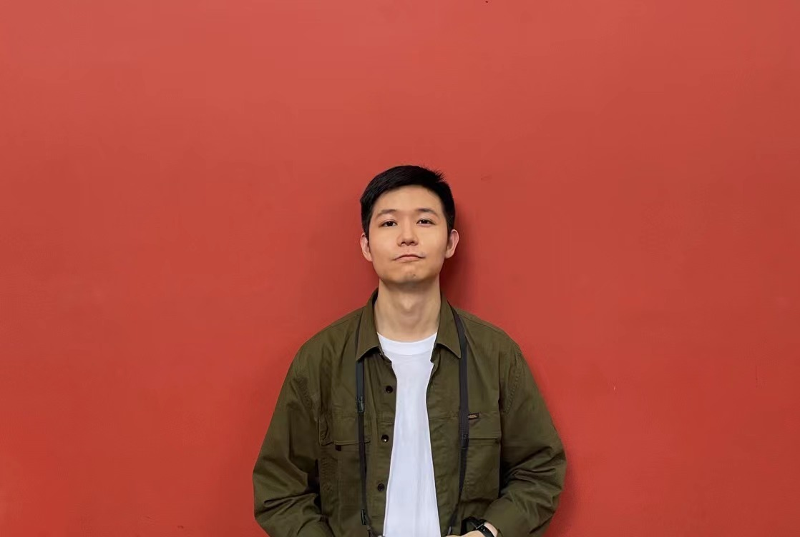
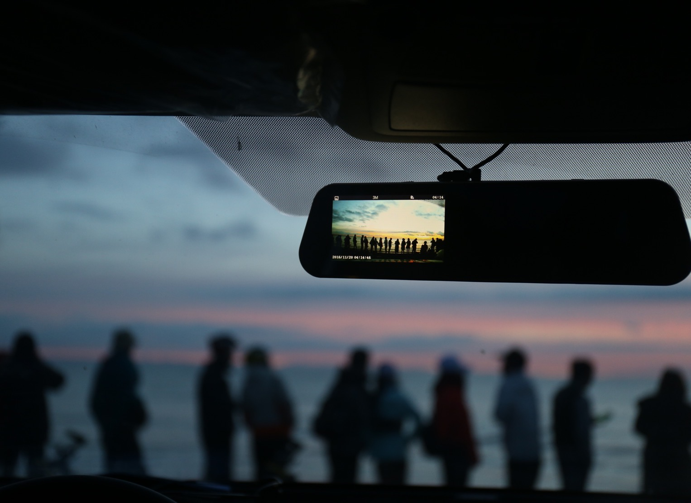

---

---

# Welcome to Zixuan's Org

Hi, you can call me Zixuan.

I love swimming and photographing.  

This is the photo when I was in Chengdu.

Here are some photos in Qinghai.

This is the Qinghai Lake.

...

I was doing research on Few-Shot Learning when I was in NUDT. FSL is a research field in machine learning. I was focusing on object detection task in CV based on remote sensing images and had two papers published. If you are interested in it, it is welcomed to discuss the detail in the papers with me. Here are the Links:

https://doi.org/10.1109/JSTARS.2021.3078177

https://doi.org/10.1117/12.2577473

Now, I am working on big data analysis based on Spark. We may study together if you are keen on it as well.

Glad to meet you in Shenzhen next year!

